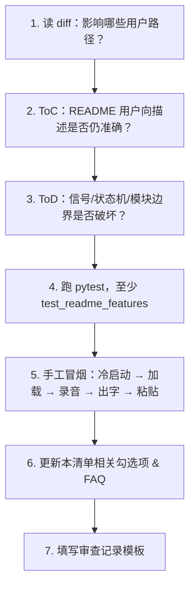

# VoiceInk — 语音转文字桌面工具

本地离线语音转文字：采集**麦克风** / **电脑播放声** / **混合** → 本地 ASR 识别 →（可选）大模型润色 → 自动粘贴到光标位置。默认 **自动持续转写**（按住快捷键开始整场监听，停顿后自动出字）；也可切换为 **按住说话、松开识别**。

版本号以 **`voiceink/version.py`** 中的 `__version__` 为准；安装包文件名、Inno 元数据与 Windows 下 `VoiceInk.exe` 属性均与之同步。

**文档导航**

| 读者 | 建议阅读 |
|------|----------|
| **普通用户（ToC）** | [功能一览](#功能一览) → [快速上手](#快速上手) → [常见问题](#常见问题) |
| **开发者 / 维护者（ToD）** | [代码架构](#代码架构) → [测试](#测试) → [**变更审查清单（必读）**](#变更审查清单必读) |

---

## 功能一览

VoiceInk 是一款**本地离线**语音转文字桌面工具：采集麦克风或电脑播放的声音 → 本地 ASR 识别 →（可选）大模型润色 → 自动粘贴到当前光标位置。全程可在无网络环境下完成识别（润色需联网）。

### 1. 两种触发方式

| 模式 | 说明 | 适用场景 |
|------|------|----------|
| **自动持续转写**（默认） | **按住快捷键**开始整场监听；检测到说话并停顿后自动识别、粘贴；可连续多句。**结束整场监听**：按 **Esc** 或点击浮窗右上角 **×**（已在识别中的片段仍会完成输出） | 会议记录、长时间口述、连续输入 |
| **按住快捷键录音** | **按住**说话，**松开**结束并识别；录音中按 **Esc** 取消 | 短句输入、精确控制每段录音 |

- 全局快捷键默认 **Alt+Space**（新安装）；可在设置中自定义。中文 Windows 上 **勿用 Ctrl+Space**（常被输入法占用）
- 短按防误触：需按住约 **0.12 秒** 以上才触发，避免误录
- 松开快捷键**不会**结束持续转写模式下的整场监听

### 2. 音频采集

| 来源 | 说明 |
|------|------|
| **仅麦克风** | 收录你的说话声 |
| **仅电脑播放** | 转写视频、会议远端、系统播放的声音 |
| **麦克风 + 电脑播放** | 混合采集，适合开会（远端 + 自己都要） |

- **16 kHz 单声道**采集，自动重采样与混音
- **测试声音**（约 2 秒）：在设置中一键验证当前设备是否有输入
- **设备管理**：麦克风 / 电脑声设备可「自动选择」或手动指定；支持刷新列表、恢复自动选择
- **Windows**：优先 WASAPI 环回；支持 **PyAudioWPatch** 采集电脑播放声（无需立体声混音）；亦可启用立体声混音或 VB-Audio 虚拟声卡
- **macOS**：需 BlackHole 等虚拟声卡路由系统输出
- **Linux**：选择 PulseAudio/PipeWire 的 monitor 源

### 3. 离线语音识别（ASR）

- 引擎：**sherpa-onnx**，识别在本地 CPU 完成，**无需联网**
- 内置 **8 款模型**，设置页一键下载 / 切换 / 删除；托盘右键也可快速切换已下载模型
- **默认模型：FireRedASR2**（中文准确率高，含 20+ 种方言）
- 识别结果自动清洗 `<asr_text>`、`<sil>` 等模型标记，只保留纯文本
- 后台线程加载与识别，不阻塞界面
- **已下载 ≠ 已载入**：设置里选好模型只表示磁盘上有文件；**每次冷启动**仍须将模型载入内存（FireRedASR2 约 **10–40 秒**），浮窗会显示「模型加载中」，托盘就绪后再使用
- 持续模式下 **VAD 自动切分**：按说话停顿分段，多段可排队依次识别；停止监听时会 **flush 收尾句**，避免最后一句丢失

| 模型 | 特点 | 语言 | 约体积 |
|------|------|------|--------|
| **FireRedASR2**（默认） | 中文准确率最高，含方言 | 中/英/方言 | 740 MB |
| FireRedASR2 AED | 最高准确率，较慢 | 中/英/方言 | 1.2 GB |
| Qwen3-ASR 1.7B | 阿里大模型 ASR 旗舰版，精度更高 | 中/英/多语种 | 2.4 GB |
| Qwen3-ASR 0.6B | 阿里大模型 ASR，高精度 | 中/英/多语种 | 983 MB |
| Paraformer 中文 | 高精度中英文 | 中/英 | 240 MB |
| Paraformer 三语 | 中英粤三语 | 中/英/粤 | 240 MB |
| SenseVoice | 极速，多语种 | 中/英/日/韩/粤 | 230 MB |
| Zipformer CTC | 轻量快速，纯中文 | 中 | 367 MB |

- 模型来源：HuggingFace，支持**断点续传**下载
- 模型目录可自定义，更改时**自动迁移**已下载文件
- 安装包可内置 FireRedASR2，开箱即用

### 4. 文字输出

- **自动粘贴**到当前前台窗口光标位置（模拟 Ctrl+V / Cmd+V）
- 粘贴前校验前景窗口焦点；**无法确认粘贴成功**时降级为「已复制到剪贴板」，提示手动 Ctrl+V（避免误报「已输入」）
- 无法定位输入框时，文字写入**剪贴板**，可手动粘贴
- 避免粘贴到 VoiceInk 自身窗口
- 跨平台：**Windows**（win32）、**macOS**（osascript）、**Linux/X11**（xdotool）

### 5. LLM 智能润色（可选）

- 识别完成后，可选调用 **OpenAI 兼容 API** 做口语转书面语
- 支持 DeepSeek、通义千问、Ollama 等兼容接口
- 可配置：接口地址、API Key、模型名称、自定义 System Prompt
- 内置默认润色规则：去口语赘词、补标点、理顺语序，**保持原意不变**
- 设置页 **测试连接** 验证 API 是否可用
- **润色失败时**自动降级输出 ASR 原文，不阻断使用
- **未启用时**直接输出 ASR 原文，不联网

### 6. 界面与状态反馈

**悬浮窗**（屏幕底部居中，置顶半透明）：

| 状态 | 显示 |
|------|------|
| 模型加载中 | 黄色提示 + 预计等待说明；**此阶段请勿开始录音** |
| 已就绪 | 绿色提示（按住快捷键模式）；加载完成后自动切换 |
| 待开始 | 持续模式：提示按住快捷键开始 |
| 自动监听中 | 声波动画 + 停顿后自动出字；**Esc** 或 **×** 结束整场 |
| 录音中 | 声波动画 +「松开结束 · Esc 取消」（按住说话模式） |
| 识别中 / 润色中 | 状态文字，可选预览片段 |
| 已输入 / 已复制 / 已取消 | 短暂提示后自动关闭 |
| 错误 / 警告 | 红色或橙色提示；加载中时不被其它错误覆盖 |

- 实时**声波动画**反映音量
- **提示音**：录音开始 / 结束 / 错误（可在设置中开关）

**系统托盘**：

- **单击 / 双击** → 打开设置
- **右键菜单** → 打开设置、切换模型、开机自启、退出
- 托盘图标随录音状态变色；悬停显示「模型加载中 / 监听中 / 录音中 / 识别中 / 润色中」

### 7. 设置中心（四页）

| 页面 | 内容 |
|------|------|
| **通用** | 快捷键录制、开机自启、提示音、音频来源、触发方式、测试声音、高级设备选择 |
| **模型** | 8 款模型卡片（准确率/速度/语言/大小）、下载进度、设为当前、删除、存储路径更改与迁移 |
| **润色** | 启用开关、API 配置、润色提示词、测试连接 |
| **关于** | 版本号、当前模型、已下载统计、模型目录、配置文件路径、快捷键 |

- 配置保存在 `~/.voiceink/config.json`，**延迟写入**防频繁刷盘
- 修改触发方式或音频来源后需点 **保存设置** 生效
- 首次运行显示**欢迎引导**（音频来源与模型下载说明）

### 8. 系统集成

- **开机自启**（Windows 注册表 / 设置页 / 托盘菜单）
- 安装程序写入注册表时，应用启动会**自动同步**自启状态
- 退出时保存配置、释放模型与录音资源

### 9. 打包与分发

- **PyInstaller** 打包便携版 `dist/VoiceInk/VoiceInk.exe`
- **Inno Setup** 生成安装包 `dist/VoiceInk-Setup-<版本>.exe`
- 打包可内置 FireRedASR2，用户无需单独下载
- 版本号统一由 `voiceink/version.py` 管理，同步 EXE 属性与安装包文件名

### 10. 跨平台

| 平台 | 能力 |
|------|------|
| **Windows 10/11** | 完整支持；系统声 / 混合模式体验最佳 |
| **macOS** | 支持；需辅助功能权限；系统声需虚拟声卡 |
| **Linux (X11)** | 支持；需 `xdotool`；monitor 源作系统声 |
| **Linux (Wayland)** | 部分支持；pynput 可能有兼容问题 |

---

## 声音收录

默认 **同时收录**：周围说话声（麦克风）+ 电脑正在播放的声音。在 **设置 → 通用** 点 **测试声音** 即可验证；设备异常时展开 **设备设置** 调整（一般保持「自动选择」即可）。

---

## 环境要求

| 依赖 | 版本要求 | 说明 |
|------|----------|------|
| Python | **3.10+** | 从源码运行 / 打包时需要 |
| pip | 最新版 | 安装依赖 |

> **使用 `VoiceInk-Setup-*.exe` 安装后无需 Python。**

主要依赖见 `requirements.txt`：`PyQt6`、`sherpa-onnx`、`sounddevice`（麦克风 / 系统声 / 混合采集）、`pynput`、`httpx`、`numpy` 等。

---

## 快速上手

### Windows：安装包（推荐）

安装 **`dist/VoiceInk-Setup-<版本号>.exe`**（如 `VoiceInk-Setup-1.3.2.exe`）。仓库里通常**不包含**该安装包，需自行打包，见下文「[没有 EXE？从源码一键打包](#没有-exe从源码一键打包)」。

### Windows：便携目录

`python build.py` 后运行 `dist/VoiceInk/VoiceInk.exe`（需与 `models/`、`_internal/` 同级分发）。同样需先按下文从源码打包。

### 从源码运行

```bash
pip install -r requirements.txt
python run.py
```

Windows 若 `python` 指向 3.14 等未装依赖的解释器，请改用：

```bash
py -3.10 -m pip install -r requirements.txt
py -3.10 run.py
```

模型：**设置 → 模型** 下载；或放到 `models/`、`~/.voiceink/models/`（目录名与内置注册表一致）。

### 首次使用

1. 启动应用，等待浮窗从 **「模型加载中」** 变为 **「已就绪」** 或 **「待开始」**（FireRedASR2 首次载入约 10–40 秒，属正常现象）
2. 托盘图标 → 单击打开 **设置**
3. **模型**：安装包已内置 **FireRedASR2**；从源码运行时在 **设置 → 模型** 下载，或放到 `models/` / `~/.voiceink/models/`
4. **通用**：点 **测试声音** 确认有输入；确认触发方式为「自动持续转写」或「按住快捷键」
5. 托盘提示「已就绪」后：
   - **持续转写（默认）**：**按住 Alt+Space**（约 0.2 秒）开始监听 → 说话并停顿 → 自动出字 → **Esc** 或浮窗 **×** 结束
   - **按住说话**：**按住 Alt+Space** 说话 → **松开** 识别并粘贴

### 操作指南

| 操作 | 持续转写（默认） | 按住说话模式 |
|------|------------------|--------------|
| **按住快捷键** | 开始整场监听 | 开始本段录音 |
| **松开快捷键** | 不结束监听 | 结束并识别 |
| **Esc** | 结束整场监听 | 取消当前录音 |
| **浮窗 ×** | 结束整场监听 | 关闭浮窗 |
| **单击托盘** | 打开设置 | 同左 |
| **右键托盘** | 切换模型 / 设置 / 退出 | 同左 |

> **快捷键无反应？** 检查是否仍在「模型加载中」；若已就绪仍无反应，请到 **设置 → 通用** 将快捷键改为 **Alt+Space**（勿用 Ctrl+Space，输入法常占用）。保存后重试。

识别结果会自动去掉 `<asr_text>`、`<sil>` 等模型标记，只保留纯文本。

---

## 支持平台

| 平台 | 状态 | 备注 |
|------|------|------|
| Windows 10/11 | 完整支持 | 系统声 / 混合推荐在本平台使用 |
| macOS | 支持 | 辅助功能权限；系统声需虚拟声卡 |
| Linux (X11) | 支持 | `xdotool`；monitor 源作系统声 |
| Linux (Wayland) | 部分支持 | pynput 可能有兼容问题 |

---

## 配置大模型润色（可选）

**设置 → 润色**：勾选启用，填写 API URL / Key / 模型名（OpenAI 兼容，含 DeepSeek、通义、Ollama 等）。

---

## 自定义模型存储路径

**设置 → 模型** → 存储位置 **更改**，已下载模型会迁移。默认 `~/.voiceink/models/`。

---

## 版本号（发布前必读）

- **唯一来源：** `voiceink/version.py` 的 `__version__`
- 同步：关于页、EXE 文件版本、Inno `VoiceInk-Setup-<version>.exe`

---

## 没有 EXE？从源码一键打包

克隆或下载源码后，若 `dist/` 下没有现成的 `VoiceInk-Setup-*.exe` 或 `VoiceInk/VoiceInk.exe`，可在 **Windows** 上按下面步骤本地生成。

### 前置条件

| 项目 | 说明 |
|------|------|
| 操作系统 | **Windows 10/11**（打包脚本面向 Windows） |
| Python | **3.10+**，并已加入 PATH |
| 依赖 | `pip install -r requirements.txt`（含 PyInstaller） |
| FireRedASR2 模型 | 打包前**必须**在本地就绪（见下一步） |
| Inno Setup 6 | 仅生成**安装包**时需要；[下载安装](https://jrsoftware.org/isdl.php) |

### 第一步：准备内置模型（首次必做）

打包会把 **FireRedASR2** 打进产物，本地没有则 `build.py` 会直接报错退出：

```bash
pip install -r requirements.txt
python voiceink_build/download_bundle_model_for_build.py
```

脚本会把模型下载到项目根目录的 `models/`。若你已在应用里下载过同一模型，也可放在 `~/.voiceink/models/`。

### 第二步：选择打包方式

**方式 A — 一键安装包（推荐分发）**

生成 `dist/VoiceInk-Setup-<版本号>.exe`（版本号来自 `voiceink/version.py`）：

```bash
python build_release.py
```

等价于依次执行 `build.py`（PyInstaller）+ Inno Setup；成功后默认删除中间目录 `dist/VoiceInk/`，只保留安装包。

**方式 B — 仅便携版 EXE 目录**

不需要 Inno Setup，只生成可运行的绿色版文件夹：

```bash
python build.py
```

完成后运行 **`dist/VoiceInk/VoiceInk.exe`**。分发时需整包拷贝 `dist/VoiceInk/`（含 `_internal/`、`models/` 等），不要只拷单个 exe。

### 打包产物一览

| 命令 | 输出路径 | 用途 |
|------|----------|------|
| `python build_release.py` | `dist/VoiceInk-Setup-<版本>.exe` | 双击安装，与普通用户分发 |
| `python build.py` | `dist/VoiceInk/VoiceInk.exe` | 免安装便携版，或 zip 整目录分发 |

调试时可保留中间目录：`python build_release.py --keep-staging`。

### 常见问题（打包）

- **提示缺少 FireRedASR2 模型** → 先运行 `python voiceink_build/download_bundle_model_for_build.py`
- **Inno Setup 找不到** → 安装 [Inno Setup 6](https://jrsoftware.org/isdl.php)，或改用方式 B 只打便携版
- **`build/` 文件夹是什么** → PyInstaller 临时缓存（已在 `.gitignore`），可删；与 `build.py` 脚本不是一回事

---

## 打包（脚本说明）

| 脚本 | 作用 |
|------|------|
| `build.py` | PyInstaller → `dist/VoiceInk/` |
| `build_release.py` | `build.py` + Inno → `dist/VoiceInk-Setup-<version>.exe` |
| `voiceink_build/download_bundle_model_for_build.py` | 打包前下载默认模型（FireRedASR2）到 `./models/` |

**说明：** 仓库根目录下的 `build/` 为 PyInstaller **临时构建缓存**（已在 `.gitignore`），可随时删除，下次打包会自动重建；**不要**与 `build.py` / `build_release.py` 脚本混淆。

---

## 代码架构

```
启动 → 配置加载 → 模型异步载入内存 → 热键监听就绪
  → 按住快捷键 → 录音（麦克风 / 系统 / 混合）
  → VAD 切分（持续模式）→ ASR → [润色] → 粘贴校验 → 输出
```

| 模块 | 文件 | 职责 |
|------|------|------|
| 入口 | `main.py` / `run.py` | 单实例、Qt 应用、异常钩子 |
| 协调器 | `app.py` | 信号路由、状态机、录音→识别→润色→输出 |
| 配置 | `config.py` | `~/.voiceink/config.json`（含 `audio.*`、`output.*`） |
| 录音 | `audio_recorder.py` | 多路采集、混音、16 kHz、VAD 分段、持续模式 flush |
| 设备 | `audio_devices.py` | 枚举麦克风 / 系统回放设备 |
| 音频工具 | `audio_utils.py` | 重采样、混音 |
| VAD | `vad_segmenter.py` | 持续模式语音切段与 `flush()` |
| 识别 | `speech_recognizer.py` | sherpa-onnx、模型下载、后台载入 |
| 粘贴 | `text_paster.py` | 异步粘贴 + 焦点校验 |
| 其它 | `hotkey_manager.py`、`text_polisher.py`、`ui/*` | 快捷键、润色、浮窗/托盘/设置 |

**关键状态信号（维护时勿断线）**

| 信号 | 来源 | 处理方 | 用途 |
|------|------|--------|------|
| `ready` | `SpeechRecognizer` | `app._on_stt_ready` | 模型载入完成 → 更新浮窗/托盘 |
| `model_load_progress` | `SpeechRecognizer` | `app._on_model_load_progress` | 加载中 / 失败提示 |
| `segment_ready` | `AudioRecorder` | `app._on_segment_ready` | 持续模式分段入队 |
| `esc_pressed` | `HotKeyManager` | `app._on_esc_pressed` | 结束持续监听 / 取消录音 |

---

## 项目结构

```
VoiceInk/
├── voiceink/
│   ├── main.py, app.py, config.py, version.py
│   ├── audio_recorder.py, audio_devices.py, audio_utils.py
│   ├── speech_recognizer.py, text_polisher.py, text_paster.py
│   ├── hotkey_manager.py, sound_manager.py
│   └── ui/
├── models/                 # 本地模型（gitignore，打包前需 FireRedASR2）
├── dist/                   # 发布产物：VoiceInk-Setup-<ver>.exe
├── installer/              # Inno Setup
├── voiceink_build/         # PyInstaller hook、默认模型下载脚本
├── build.py                # PyInstaller → dist/VoiceInk/
├── build_release.py        # build.py + Inno 一键发布
├── run.py
├── requirements.txt
└── README.md
```

---

## 测试

```bash
# 推荐 Python 3.10
py -3.10 -m pip install -r requirements.txt pytest
py -3.10 -m pytest tests/ -q
```

与 README 功能描述强相关的用例：`tests/test_readme_features.py`。变更 `app.py`、触发方式、持续模式、模型就绪流程后**必须**跑通该文件。

---

## 变更审查清单（必读）

> **规则：** 每次功能新增、行为修改或 Bug 修复合并前，维护者须按本清单**完整走一遍**。不得只改代码不更新 README，不得只更新文档不跑验证。审查结论写入 PR 描述或变更说明（可用下方模板）。

### 一、审查流程（固定顺序）



### 二、冷启动全链路（从 `run.py` 到首次出字）

| 步骤 | 预期行为 | 关键文件 |
|------|----------|----------|
| 1. 单实例 | 重复启动提示「已在运行」 | `main.py` |
| 2. 读配置 | 缺省项合并默认值；新装 `hotkey=alt+space` | `config.py` |
| 3. 模型载入 | 浮窗「模型加载中」+ 托盘 tooltip；**同模型已驻留内存则跳过重复载入** | `speech_recognizer.py`, `app._configure_stt` |
| 4. 就绪反馈 | 浮窗变「已就绪」/「待开始」；托盘通知；**浮窗与托盘状态一致** | `app._on_stt_ready` |
| 5. 热键启动 | `start()` 后全局热键生效；加载未完成时按键被拦截并提示 | `hotkey_manager.py`, `app._show_model_not_ready` |
| 6. 首次欢迎 | 模型就绪后再弹（未下载时超时兜底） | `app._show_first_run_welcome_once` |

### 三、核心价值：可靠交付文字（P0）

| 检查项 | 用户视角验收 | 代码锚点 |
|--------|--------------|----------|
| 粘贴不假成功 | 管理员窗口/密码框等粘贴失败时显示「已复制」，不误报「已输入」 | `text_paster.paste_async`, `app._handle_paste_result` |
| 持续模式收尾句 | 说完立刻点 ×，最后一句仍进入识别 | `vad_segmenter.flush`, `audio_recorder._flush_continuous_segments` |
| 加载期不误报 | 加载中不出现红色「未识别」盖住「加载中」 | `floating_window._model_loading_active`, `app._on_final_result` |

### 四、首次体验与可理解性（P1）

| 检查项 | 用户视角验收 | 代码锚点 |
|--------|--------------|----------|
| 默认热键 | 新装默认 Alt+Space；Ctrl+Space 冲突有提示 | `config.DEFAULT_CONFIG`, `app._on_hotkey_tap_too_short` |
| 模型加载反馈 | 下载≠载入；冷启动等待有浮窗+托盘说明 | `app._configure_stt`, `app._on_model_load_progress` |
| 润色失败降级 | API 失败时安静输出原文，不先闪红错 | `app._on_polish_error` |
| 加载失败可见 | 模型载入失败时浮窗红色报错，不卡在黄色加载中 | `app._on_model_load_progress`, `app._on_recognizer_error` |

### 五、场景顺手与边界（P2）

| 检查项 | 用户视角验收 | 代码锚点 |
|--------|--------------|----------|
| Esc 结束持续监听 | 持续模式中 Esc 结束整场 | `app._on_esc_pressed` |
| 托盘监听态 | 持续监听时 tooltip 显示「监听中」 | `tray_icon.set_activity_tooltip` |
| 长时间无声音 | 持续模式 30s 无有效语音有提示 | `audio_recorder.no_speech_warning` |
| 混合采集降级 | 系统声失败时浮窗+托盘双提示 | `app._on_recorder_warning` |
| 保存设置丢队列 | 有待识别段时保存前确认 | `settings_window._save_settings` |
| 关于页文案 | 文案与当前触发方式一致 | `settings_window._refresh_about_footer` |
| 持续监听 UI 时序 | 录音通道打开后才显示「自动监听中」 | `app._start_continuous_listening` |

### 六、ToC 文档同步检查（面向用户）

每次变更后核对 README 下列段落是否与**真实行为**一致（以代码为准，不以记忆为准）：

- [ ] 开篇与「两种触发方式」表格
- [ ] 默认快捷键与 Esc / 浮窗 × 说明
- [ ] 「已下载 ≠ 已载入」与冷启动等待说明
- [ ] 浮窗 / 托盘状态表
- [ ] [快速上手](#快速上手) 与 [操作指南](#操作指南)
- [ ] [常见问题](#常见问题) 是否覆盖新踩坑点

### 七、ToD 技术检查（面向开发者）

- [ ] `app._connect_signals` 新增信号是否已接线
- [ ] `SpeechRecognizer.configure` 是否避免同模型无谓重载
- [ ] 异步边界：`QTimer` 延迟开录是否二次校验 `is_ready`
- [ ] 浮窗状态锁：loading 期间 `show_error` 是否被正确抑制或先解锁
- [ ] `tests/test_readme_features.py` 是否更新或新增用例
- [ ] 版本号仅改 `voiceink/version.py`（若发版）

### 八、手工冒烟脚本（Windows 建议）

1. **冷启动**：`py -3.10 run.py` → 观察浮窗加载 → 就绪 → 托盘一致  
2. **按住模式**：按住热键说话 → 松开 → 记事本出现文字  
3. **持续模式**：按住开始 → 连说两句停顿 → 两句均出字 → Esc 结束 → 最后一句不丢  
4. **粘贴降级**：在无法粘贴的窗口测试 → 应提示「已复制」  
5. **设置保存**：监听中有排队段时保存 → 应弹确认  
6. **模型切换**：托盘换模型 → 浮窗加载 → 就绪后可识别  

### 九、审查记录模板（复制到 PR / 变更说明）

```markdown
## VoiceInk 体验审查

- 变更摘要：（一句话）
- 影响路径：冷启动 / 持续模式 / 按住模式 / 粘贴 / 设置 / 模型 / 其他

### 清单结果
- [ ] 第三节 P0 全部通过
- [ ] 第四节 P1 全部通过（或注明已知例外）
- [ ] 第五节 P2 适用项已通过
- [ ] 第六节 ToC README 已同步
- [ ] 第七节 ToD 技术项已核对
- [ ] pytest：`test_readme_features` 通过

### 手工冒烟
- [ ] 冷启动加载→就绪
- [ ] 至少一种模式完整出字
- [ ] （若涉及粘贴）降级路径已测

### 遗留风险
- （无 / 列出已知限制）
```

---

## 常见问题

**Q: 设置里明明选好模型了，为什么启动还要等很久？**  
A: **下载/选好** 只表示磁盘上有模型文件；每次冷启动仍要把模型（FireRedASR2 约 740MB）**载入内存**，通常 10–40 秒。请等浮窗从「模型加载中」变为「已就绪」或「待开始」后再按热键。若超过 2 分钟，查看终端是否报 `模型加载失败`，或换更小的 SenseVoice 试环境。

**Q: 托盘说已就绪，浮窗还在加载中？**  
A: 正常应同步：托盘与浮窗同时进入就绪。若浮窗仍停在黄色「模型加载中」，请确认已用最新代码；就绪前请勿按热键，以浮窗状态为准。

**Q: 如何转写电脑里播放的声音？**  
A: **设置 → 通用 → 声音收录** 中「音频来源」选「仅电脑播放」或「麦克风 + 电脑播放」。Windows 建议安装 `PyAudioWPatch`；无环回时启用立体声混音或 VB-Audio。

**Q: 自动持续转写怎么用？**  
A: **设置 → 通用 → 触发方式** 选「自动持续转写」（默认）。**按住快捷键**开始整场监听；说话过程中会 **正常识别并自动粘贴**（说完一句稍停顿即可出字）。**结束整场监听**：按 **Esc** 或点击浮窗右上角 **×**；已在识别中的那一段仍会完成输出。下次再 **按住快捷键** 重新开始。开会请选「麦克风 + 电脑播放」。

**Q: 混合模式只有麦克风有声音？**  
A: **刷新** 设备列表，选对 **系统声音设备**；测试时同时说话并播放电脑声音。

**Q: 短按快捷键后浮窗不消失？**  
A: 短按不会进入录音；若仍提示「录音过短」，浮窗会在数秒内自动关闭。请**按住约 0.2 秒以上**再说话。

**Q: 识别结果里有 `<asr_text>` 或 `<sil>` 字样？**  
A: 应用会自动清洗 FireRedASR2 / Qwen3 等模型输出的内部标记；若仍出现，请确认使用的是最新版本。

**Q: 打包时提示缺少 FireRedASR2 模型？**  
A: 运行 `python voiceink_build/download_bundle_model_for_build.py`，或将模型目录放到 `models/` 或 `~/.voiceink/models/`（目录名 `sherpa-onnx-fire-red-asr2-ctc-zh_en-int8-2026-02-25`）。

**Q: `build/` 文件夹可以删吗？**  
A: 可以。那是 PyInstaller 缓存，已在 `.gitignore`，删除不影响源码；重新执行 `build.py` 会再生成。

**Q: 识别准确率不高？**  
A: 默认已使用 FireRedASR2；可尝试 **Qwen3-ASR 1.7B**、**Qwen3-ASR 0.6B** 或 **FireRedASR2 AED** 进一步提高准确率，或换 **SenseVoice** 换取更快速度。

**Q: 快捷键冲突？**  
A: **设置 → 通用** 修改组合键。

**Q: 无法自动粘贴？**  
A: 部分窗口（管理员终端、密码框、部分游戏）会拦截 Ctrl+V。应用会提示「已复制到剪贴板」，请手动 Ctrl+V。若误报「已输入」请反馈并升级到最新版。

**Q: 不想润色？**  
A: 不启用 LLM 润色即可。

**Q: 模型下载失败？**  
A: HuggingFace 支持断点续传；可配置代理。

**Q: Linux / macOS 权限？**  
A: Linux 安装 `xdotool`；macOS 在 **隐私与安全性 → 辅助功能** 授权。

---
